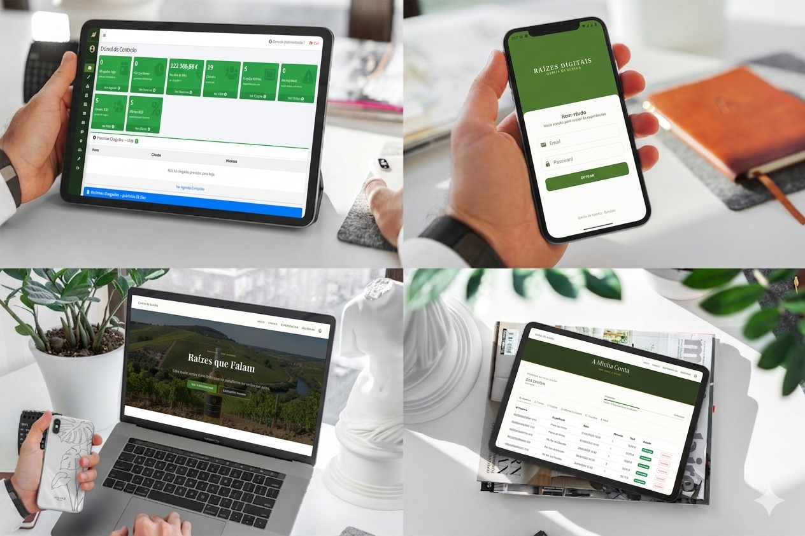

# Raizes Digitais
## Plataforma de Enoturismo Digital da Quinta da Azenha



[](https://dotnet.microsoft.com/)
[](https://www.microsoft.com/sql-server/)
[](https://getbootstrap.com/)
[](https://kotlinlang.org/)
[](LICENSE)

> **Projeto Final ATEC TPSI-CAS-0725 | Desenvolvido por GCh85**
>
> Sistema de gestão de enoturismo da Quinta da Azenha, propriedade vitivinícola familiar em Bucelas, produtora de vinho Arinto DOC.

---

## Índice

- [Funcionalidades](#funcionalidades)
- [Arquitetura](#arquitetura)
- [Stack-Tecnológico](#️stack-tecnológico)
- [Base de Dados](#base-de-dados)
- [Website Público](#website-público)
- [Backoffice](#backoffice)
- [App Android](#app-android)
- [Gamificação](#gamificação)
- [Inteligência Artificial](#inteligência-artificial)
- [Setup Local](#setup-local)
- [Desenvolvimento](#desenvolvimento)
- [Estrutura do Projeto](#estrutura-do-projeto)
- [Contribuição](#contribuição)
- [Licença](#licença)

---

## Funcionalidades

### Website Público

- **Catálogo de Experiências** - Prova de Vinhos, Visita à Vinha, Almoço Rural, Estadia
- **Sistema de Reservas** - Escolha de data/pessoas, cálculo automático de preço
- **Autenticação** - Registo, login, 2FA, recuperação de password
- **Área Pessoal** - Histórico de reservas, favoritos, pontos de fidelização
- **Email + PDF** - Confirmação automática com anexo iText 9

### Backoffice

- **Dashboard** - KPIs do dia, reservas, receita, alertas de stock
- **Gestão de Reservas** - Criar, editar, alterar estado, cancelar (atribuição atómica de pontos)
- **CRM** - Ficha completa do cliente (alergias, preferências, histórico)
- **Gestão de Vinhos** - Catálogo com stock, perfil sensorial
- **Gestão de Experiências** - Criar, editar, disponibilidade
- **Programa de Fidelização** - Cupões automáticos On-Demand
- **Moderação** - Aprovar testemunhos e notas de prova

### App Android

- **Login** - Autenticação SHA-256 sincronizada
- **Catálogo de Vinhos** - Lista reativa (Jetpack Compose)
- **QR Scanner** - Gamificação física (ZXing)
- **Avaliações** - Lógica de "Voto Único" (Anti-Farming)
- **Favoritos** - Sincronização Omnichannel
- **Arquitetura** - MVVM + Clean Patterns + Coroutines

### Sistema de Gamificação

- **Pontuação por Ação** - Reserva confirmada, QR lido, avaliação
- **Níveis de Fidelização** - Visitante -> Conhecedor -> Sommelier -> Embaixador
- **Pontos Resgatáveis** - Troca por cupões de desconto
- **Narrativa IA** - Adapta-se ao nível do cliente

### Inteligência Artificial

- **Narrativa Personalizada** - IA gera texto de acordo com o nível de fidelização
- **OpenRouter API** - Integração com modelos de linguagem

---

## Arquitetura

```
┌─────────────────────────────────────────────────────────────────────────────┐
│                        WEBSITE PÚBLICO                                      │
│                   Quinta da Azenha (ASP.NET Web Forms)                      │
│                  Bootstrap 5 + JavaScript + jQuery                          │
└───────────────────────────────────┬─────────────────────────────────────────┘
                                    │ HTTP/Post
                                    ▼
┌─────────────────────────────────────────────────────────────────────────────┐
│                    SERVIDOR (IIS Express)                                   │
│  ┌─────────────────────────────────────────────────────────────┐            │
│  │                APRESENTAÇÃO (Code-Behind C#)                │            │
│  │  • ASPX Pages + Master Pages                                │            │
│  │  • Code-Behind (.aspx.cs)                                   │            │
│  │  • Handlers (.ashx) -> JSON para API                        │            │
│  └─────────────────────────────────────────────────────────────┘            │
│                                    │                                        │
│                                    ▼                                        │
│  ┌─────────────────────────────────────────────────────────────┐            │
│  │              LÓGICA DE NEGÓCIO (App_Code)                   │            │
│  │  • Seguranca.cs (SHA-256 + Salt)                            │            │
│  │  • Email.cs (SmtpClient)                                    │            │
│  │  • GeradorPDF.cs (iText 9)                                  │            │
│  │  • Startup.cs                                               │            │
│  └─────────────────────────────────────────────────────────────┘            │
│                                    │                                        │
│                                    ▼                                        │
│  ┌─────────────────────────────────────────────────────────────┐            │
│  │              PERSISTÊNCIA (Stored Procedures)               │            │
│  │  • SqlCommand + SqlParameter                                │            │
│  │  • CommandType.StoredProcedure                              │            │
│  │  • Transações quando necessário                             │            │
│  └─────────────────────────────────────────────────────────────┘            │
└───────────────────────────────┬─────────────────────────────────────────────┘
                                │
                                ▼
┌─────────────────────────────────────────────────────────────────────────────┐
│                       SQL SERVER EXPRESS                                    │
│  ┌──────────────────────┐   ┌───────────────┐   ┌───────────────┐           │
│  │   13 Tabelas         │   │  106 SPs      │   │     Views     │           │
│  │                      │   │               │   │               │           │
│  │ • clientes           │   │ • sp_login    │   │ • v_kpis      │           │
│  │ • reservas           │   │ • sp_inserir_ │   │               │           │
│  │ • experiencias       │   │   reserva     │   │               │           │
│  │ • vinhos             │   │ • sp_listar_  │   │               │           │
│  │ • favoritos          │   │  vinhos       │   │               │           │
│  │ • pontos_            │   │ • sp_obter_   │   │               │           │
│  │   fideliz.           │   │   cliente     │   │               │           │
│  └──────────────────────┘   └───────────────┘   └───────────────┘           │
└─────────────────────────────────────────────────────────────────────────────┘

┌─────────────────────────────────────────────────────────────────────────────┐
│                        APP ANDROID (KOTLIN)                                 │
│  ┌─────────────┐  ┌─────────────┐  ┌─────────────┐  ┌─────────────┐         │
│  │   Login     │  │  Catalogo   │  │  QR Scan    │  │  Favoritos  │         │
│  │             │  │   Vinhos    │  │             │  │             │         │
│  └─────────────┘  └─────────────┘  └─────────────┘  └─────────────┘         │
│                                                                             │
│  │ HTTP/JSON                                                                │
│  ▼                                                                          │
│  API REST via Handlers .ashx                                                │
└─────────────────────────────────────────────────────────────────────────────┘
```

### Arquitetura de 3 Camadas

| Camada | Tecnologia | Responsabilidade |
|--------|-----------|---------------|
| **Apresentação** | ASPX Pages + Code-Behind | UI, validação JS, postback |
| **Lógica de Negócio** | Classes C# (App_Code) | Seguranca, Email, PDF |
| **Persistência** | Stored Procedures | Acesso a dados, transações |


---

## Stack Tecnológico

| Tecnologia | Versão | Finalidade |
|------------|--------|------------|
| **ASP.NET Web Forms** | .NET Framework 4.8 | Framework web do servidor |
| **C#** | 12 | Linguagem server-side |
| **SQL Server Express** | 2022 | Base de dados relacional |
| **ADO.NET** | - | Acesso a dados |
| **Stored Procedures** | - | Lógica de dados (Zero Inline SQL) |
| **Bootstrap** | 5.3 | Framework CSS frontend |
| **JavaScript/jQuery** | 3.x | Interatividade frontend |
| **SHA-256 + Salt** | .NET native | Hash de passwords (v2 superior) |
| **iText** | 9.x | Geração de PDF profissional |
| **SmtpClient** | .NET native | Envio de emails com templates |
| **Kotlin** | 1.9.x | Linguagem app Android Reativa |
| **Jetpack Compose** | 1.5.x | UI Declarativa moderna na App |
| **Retrofit / OkHttp** | - | Comunicação API REST |
| **OpenRouter API** | - | Narrativa IA Contextual |

---

## Base de Dados

### 13 Tabelas

| # | Tabela | Descrição |
|---|-------|-----------|
| 1 | `perfis` | Perfis de acesso (Administrador, Gestor) |
| 2 | `utilizadores` | Contas do backoffice |
| 3 | `clientes` | Visitantes registados |
| 4 | `experiências` | Catálogo de experiências |
| 5 | `disponibilidade` | Calendário de sessões |
| 6 | `reservas` | Reservas efetuadas |
| 7 | `vinhos` | Catálogo de vinhos |
| 8 | `favoritos` | Vinhos favoritos por cliente |
| 9 | `avaliações_vinhos` | Avaliações de vinhos |
| 10 | `avaliações_experiências` | Testemunhos de experiências |
| 11 | `pontos_fidelização` | Histórico de pontos |
| 12 | `cupões` | Cupões de desconto |
| 13 | `qr_codigos` | QR Codes físicos na quinta |

### Stored Procedures

- **106 Stored Procedures** documentadas
- Todas as operações de leitura/escrita passam por SP
- Parâmetros OUTPUT com `.Size` obrigatório (regra das aulas)
- Transações para operações críticas (reservas)

### Estrutura de Reservas

```
reservas
├── num_reserva (UNIQUE: RD-AAAAMMDD-XXXX)
├── id_cliente -> clientes
├── id_disponibilidade -> disponibilidade
├── num_pessoas
├── preco_total (guardado no momento)
├── estado (Pendente/Confirmada/Cancelada/Concluída)
└── data_reserva
```

---

## Website Público

### Páginas Principais

| Página | Descrição | Master |
|-------|-----------|--------|
| `index.aspx` | Homepage com catálogo | Site.Master |
| `login.aspx` | Login do Backoffice | Site.Master |
| `registo.aspx` | Registo de utilizador | Site.Master |
| `recuperar_password.aspx` | Recuperação | Site.Master |
| `experiencias.aspx` | Catálogo completo | Site.Master |
| `reserva.aspx` | Formulário de reserva | Site.Master |
| `confirmacao.aspx` | Página de confirmação | Site.Master |

### Área Pessoal (Site.Master)

| Página | Descrição |
|-------|-----------|
| `conta_login.aspx` | Login de cliente |
| `conta_registo.aspx` | Registo de cliente |
| `conta_area.aspx` | Dashboard pessoal |
| `conta_reservas.aspx` | Histórico |
| `conta_favoritos.aspx` | Vinhos favoritos |
| `conta_pontos.aspx` | Pontos e níveis |

### Funcionalidades do Site

- **Catálogo Dinâmico** - Experiências ativas com imagens
- **Calendário de Disponibilidade** - Seleção de data/pessoas
- **Processo de Reserva em 3 Passos** - Escolha -> Dados -> Confirmação
- **Autenticação SHA-256 + Salt** - Nunca MD5
- **2FA por Email** - Código de 6 dígitos
- **Google OAuth** - Login com Google
- **Email de Confirmação** - Com PDF em anexo (iText 9)
- **Area Pessoal** - Histórico, favoritos, pontos

---

## Backoffice

### Páginas (AdminLTE)

| Página | Descrição | Master |
|-------|-----------|--------|
| `login.aspx` | Login administrativo | Site.Master |
| `dashboard.aspx` | KPIs e alertas | Backoffice.Master |
| `gerir_reservas.aspx` | Gestão de reservas | Backoffice.Master |
| `gerir_clientes.aspx` | CRM completo | Backoffice.Master |
| `gerir_vinhos.aspx` | Catálogo de vinhos | Backoffice.Master |
| `gerir_experiencias.aspx` | Gestão de experiências | Backoffice.Master |
| `gerir_cupoes.aspx` | Criar cupões | Backoffice.Master |
| `gerir_utilizadores.aspx` | Gestão de staff | Backoffice.Master |
| `gerir_testemunhos.aspx` | Aprovar avaliações | Backoffice.Master |
| `gerir_ofertas_b2b.aspx` | Ofertas empresariais | Backoffice.Master |

### Dashboard KPIs

- **Reservas do dia** - Total e por estado
- **Receita do mês** - Gráfico Chart.js
- **Alertas de Stock** - Vinhos abaixo do mínimo
- **Clientes VIP** - Top 5 por pontos
- **Próximas chegadas** - Hoje e amanhã

### Funcionalidades do Backoffice

- **CRUD Completo** - Todas as entidades
- **Pesquisa e Filtro** - GridView com paginação
- **Segmentação CRM** - VIP, Regular, Inativo, B2B
- **Programa de Fidelização** - Atribuir pontos manualmente
- **Cupões de Desconto** - Percentagem ou valor fixo
- **Gestão de Stock** - Alertas visuais
- **Auditoria** - Última alteração por quem

---

## App Android

### 4 Ecrãs Principais

| Ecrã | Descrição |
|------|-----------|
| **Login** | Autenticação com o sistema do site |
| **Catálogo** | Lista de vinhos filtrável |
| **QR Scanner** | Ler QR Codes físicos |
| **Favoritos** | Vinhos guardados |

### Funcionalidades da App

- Login - Integra com `sp_login_cliente`
- Lista de Vinhos - GET via handler .ashx
- Avaliação - 1-5 estrelas (ganha 10 pontos)
- QR Reader - ZXing (ganha 30 pontos)
- Favoritos - Sincroniza com site
- Reservas - Consulta e redireccionamento para o website
- Mapa - OSMDroid com localização da Quinta

### Comunicação com Servidor

```
App Android
      │
      │ HTTP/JSON
      ▼
Handlers .ashx
      ├─ api/listar_vinhos.ashx
      ├─ api/login_cliente.ashx
      ├─ api/detalhe_experiencia.ashx
      ├─ api/avaliar.ashx
      ├─ api/favorito.ashx
      ├─ api/qr_pontos.ashx
      └─ api/narrativa_ia.ashx
            │
            ▼
        Stored Procedures
            │
            ▼
      SQL Server
```

---

## Gamificação

### Pontuação por Ação

| Origem | Ação | Pontos | Notas |
|--------|------|--------|-------|
| App mobile | Avaliar vinho | **10 pts** | 1x por vinho |
| App mobile | Ler QR Code | **30 pts** | Por código |
| Ambos | Reserva confirmada | **50 pts** | - |
| Ambos | Reserva (1€ = 1 pt) | **FLOOR(preço/10)** | - |
| Backoffice | Resgate de cupão | **-pontos** | Valor negativo |

### Níveis de Fidelização

| Nível | Pontos | Narrativa IA |
|-------|--------|--------------|
| Visitante | 0–99 | Acolhedora, introdutória |
| Conhecedor | 100–299 | Detalhada |
| Sommelier | 300–599 | Técnica |
| Embaixador | 600+ | Exclusiva |

### Fonte de Verdade

Todos os pontos são registados na tabela `pontos_fidelização`:

```sql
SELECT SUM(pontos_ganhos) 
FROM pontos_fidelizacao 
WHERE id_cliente = @id
```

---

## Inteligência Artificial

### Narrativa Personalizada

A IA gera texto de acordo com o nível de fidelização do cliente:

- **Visitante** -> Texto acolhedor, introdutório
- **Conhecedor** -> Detalhado, com contexto
- **Sommelier** -> Técnico, especializado
- **Embaixador** -> Exclusivo, como o produtor

### Integração

- **OpenRouter API** - Modelos LLM
- **Prompt personalizado** - Com base nos pontos
- **Cache de resposta** - Evitar chamadas repetidas

---

## Setup Local

### Pré-requisitos

- **Visual Studio 2022** (17.8+)
- **SQL Server Express** 2022
- **SQL Server Management Studio** (SSMS)
- **Android Studio** (para a app Kotlin)
- **Git**

### Configuração da Base de Dados

```sql
-- 1. Criar base de dados
CREATE DATABASE raizes_digitais_azenha
GO

-- 2. Executar scripts na ordem:
--    BD/script_raizes_digitais_azenha.sql
--    (13 tabelas + 105 SPs + dados de teste)
```

### Configuração do Visual Studio

```bash
# 1. Abrir solução
RaizesDigitais.sln

# 2. Verificar Web.config
<connectionStrings>
  <add name="RaizesDB" 
       connectionString="Data Source=.\SQLEXPRESS;Initial Catalog=raizes_digitais_azenha;Integrated Security=True;TrustServerCertificate=True"
       providerName="System.Data.SqlClient" />
</connectionStrings>

# 3. Pressionar F5 para executar
```

### Criar Utilizador admin

```csharp
// Via código Seguranca.cs
string salt = Seguranca.GerarSalt();
string hash = Seguranca.HashPassword("Admin123!", salt);

// Executar SP
sp_inserir_utilizador 
  @utilizador = "admin"
  @email = "admin@quintaazenha.pt"
  @hash = [hash gerado]
  @salt = [salt gerado]
  @id_perfil = 1  -- Administrador
```

---

## Desenvolvimento

### Regras de Código

```
✔ Naming Controls: tb_nome, btn_guardar, lbl_erro, ddl_perfil, gv_lista
✔ Session Keys: Session["perfil"], Session["cliente_id"], Session["utilizador"]
✔ Pages: login.aspx, gerir_utilizadores.aspx
✔ Stored Procedure: CommandType.StoredProcedure
✔ Parameters: definir .Size em OUTPUT varchar
✔ Connection: ConfigurationManager.ConnectionStrings
✔ Logout: Session.Abandon() + Redirect
```

### Padrão de Conexão

```csharp
using System.Data.SqlClient;

SqlConnection myConn = new SqlConnection(
    ConfigurationManager.ConnectionStrings["RaizesDB"].ConnectionString
);
SqlCommand myCommand = new SqlCommand("nome_sp", myConn);
myCommand.CommandType = CommandType.StoredProcedure;

myCommand.Parameters.AddWithValue("@param", valor);

SqlParameter retorno = new SqlParameter();
retorno.ParameterName = "@retorno";
retorno.Direction = ParameterDirection.Output;
retorno.SqlDbType = SqlDbType.Int;
myCommand.Parameters.Add(retorno);

myConn.Open();
myCommand.ExecuteNonQuery();
int resultado = Convert.ToInt32(myCommand.Parameters["@retorno"].Value);
myConn.Close();
```


## Estrutura do Projeto

```
RaizesDigitais/
│
├── RaizesDigitais.sln
│
└── RaizesDigitais/
    ├── Web.config                # Connection string + SMTP
    ├── RaizesDigitais.csproj
    │
    ├── Seguranca.cs              # Núcleo de Criptografia (SHA-256)
    ├── Email.cs                  # Gestor de SMTP e Templates
    ├── GeradorPDF.cs             # Integração com iText 9
    ├── Startup.cs                # Configuração OWIN/Google
    │
    ├── MasterSite.Master         # Website público (Layout Base)
    ├── MasterPublico.Master      # Master para páginas públicas
    ├── MasterBackoffice.Master   # AdminLTE 3 (Gestão)
    │
    ├── Content/                  # CSS (site.css, backoffice.css)
    ├── Images/                   # Ativos visuais e fotos
    ├── Template/                 # Template PDF de confirmação
    │
    ├── Pages/                    # Páginas do Website Público
    │   ├── index.aspx            # Homepage
    │   ├── experiencias.aspx     # Catálogo
    │   ├── reserva.aspx          # Motor de Reservas (MultiView)
    │   └── conta/                # Área Pessoal do Cliente
    │
    ├── Backoffice/               # Painel Administrativo
    │   ├── dashboard.aspx        # KPIs e Business Intelligence
    │   └── gerir_*.aspx          # CRUDs e Moderação
    │
    └── Api/                      # Endpoints REST para Mobile
        ├── vinhos.ashx
        ├── login_cliente.ashx
        └── qr_pontos.ashx
```

---

## Roadmap Final

| Sprint | Foco | Estado |
|--------|------|--------|
| 1 | Infraestrutura & Base de Dados | ✅ Concluído |
| 2 | Website Público & Reservas | ✅ Concluído |
| 3 | Backoffice, CRM & Gamificação | ✅ Concluído |
| 4 | App Android (Refactored: Compose) | ✅ Concluído |
| 5 | Auditoria de Segurança & Sincronização | ✅ Concluído |


---

## Contribuição

1. Fork o repositório
2. Criar branch (`git checkout -b feature/nova-funcionalidade`)
3. Commit das alterações (`git commit -m 'Adicionar nova funcionalidade'`)
4. Push para o branch (`git push origin feature/nova-funcionalidade`)
5. Abrir Pull Request

### Convenções de Código

- Seguir [C# Coding Conventions](https://docs.microsoft.com/en-us/dotnet/csharp/fundamentals/coding-style/coding-conventions)
- Usar **Async/Await** em operações de I/O
- Validar inputs nos code-behind
- Documentar com comentários em português

---

## Licença

Propriedade de **GCh85**. Este projeto foi desenvolvido para fins académicos e de portefólio para a **ATEC TPSI-CAS-0725**. 

O código é disponibilizado para visualização e avaliação técnica. É estritamente proibida a cópia, redistribuição ou uso comercial de qualquer parte da lógica de negócio ou arquitetura sem autorização expressa. Consulte o ficheiro [LICENSE](LICENSE) para mais detalhes.

---

> **Nota de Segurança:** Por motivos de conformidade e proteção de propriedade intelectual, as chaves de API, segredos e credenciais de servidor foram omitidos ou substituídos por placeholders. O código completo para auditoria está disponível mediante solicitação.

---

<div align="center">

**Made with 🍇 by GCh85 for Quinta da Azenha**

[](https://dotnet.microsoft.com/)
[](https://getbootstrap.com/)
[](https://kotlinlang.org/)

</div>